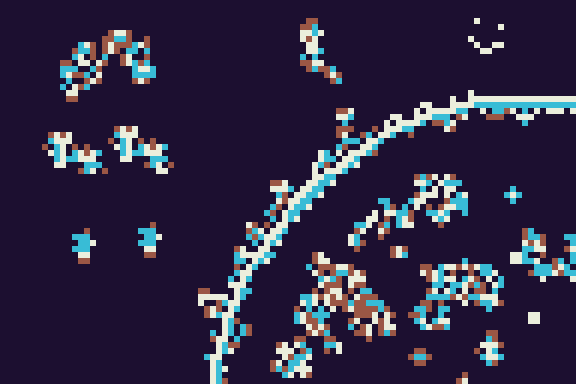

----------------------------------------------------------------------------------------------



# kaelifecpp Generalized Cellular Automata
 
## Rules explanation
```
The cellular automata in this program can have number of different 
configurations.

Let's use example Kaelife
```
```c++
{
    .name = "Kaelife",
    .stateCount = 4,
    .ruleRange = {6,9,11,24},
    .ruleAdd = {-1,1,-1,0,-1},
    .neigMask = {
        {255, 255, 255},
        {255,   0, 255},
        {255, 255, 255},
    },
    .clipTreshold = stateCount/2
}
```
```
stateCount is the number of states, 0 to 3
ruleRange is a sorted list of possible neighbor sums
ruleAdd is list of modifiers that will be added to the cell
neigMask (neighbor mask) is a 2D WorldMatrix. WorldMatrix which acts similar to vector but it 
   matches the world space orientation and it is always a rectangle. These values are a
   nominator of 255. As an example neigMask 128 will result in floor(cellValue*128/255) which
   is added to neighbor sum.
clipTreshold is value, any any cell values below it are discarded.

Each iteration following calculations are performed on each cell as follows:

-Center of the neigMask is placed on same coordinate as the current cell.
-Any cells inside the mask below clipTreshold are discarded.
-Each cell value is multiplied by corresponding neigMask value, divided by 255 and added to 
    neighbor sum.
-Neighbor sum is compared with every ruleRange element until next ruleRange is
    bigger than the neighbor sum. 
-Number of steps from ruleRange beginning is used to choose ruleAdd element
-Chosen ruleAdd element is added to currently iterated cell and clamped between 0 and 
    stateCount.
-Newly calculated cell value is written to a buffer until all cells are computed
-Completed buffer values are used for next iteration
```

## User Controls
```
The engine uses SDL2 and GLEW for simple display and keyboard and mouse input.
There is no GUI and most of the information is printed in console.
The cellular automata is displayed on window with default size of 576x384
```
```
Controls
Random rules..... [R]
Random add rule.. [T]
Random all....... [Y]
Mutate........... [M]
Draw............. mouse left/right
Draw radius...... [Q]:-1 [E]:+1
Draw random...... [W]
Simu Speed....... [1]:-1 [3]:+1
Pause............ [2], [Shift]+[P]
Iterate once..... [4]
Print rules...... [P]
Switch automata.. [,] [.]
Shader Color..... [Shift]+[N]
print frameTime.. [F]
Hue--............ [Shift]+[Q]
Hue++............ [Shift]+[E]
Color stagger--.. [Alt]+[Q]
Color stagger++.. [Alt]+[E]
Exit:............ [ESC]
```

----------------------------------------------------------------------------------------------


